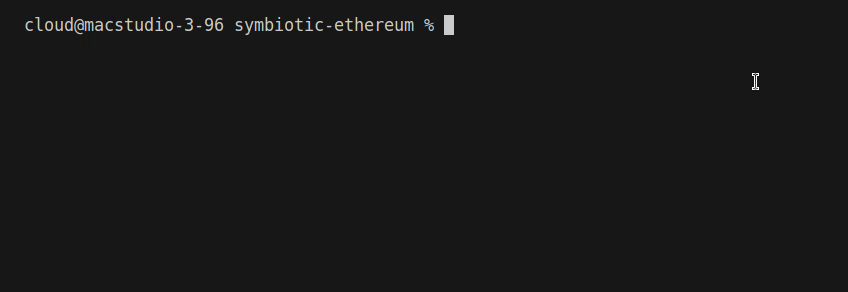

# Symbiotic Ethereum Subgraph

## Introduction

[Symbiotic](https://symbiotic.fi) is a permissionless restaking infrastructure and [the Graph](https://thegraph.com/) is a blockchain data analysis infrastructure.

Recently, [Symbiotic](https://symbiotic.fi) has been gaining more attention, but there is no related subgraph on [the Graph](https://thegraph.com/) that can query its information. Therefore, I have deployed the **first** subgraph on [the Graph](https://thegraph.com/) to provide relevant services, but for now it only supports querying collateral information related to wstETH.

- [x] wstETH
- [ ] cbETH
- [ ] wBETH
- [ ] rETH
- [ ] mETH
- [ ] swETH
- [ ] sfrxETH
- [ ] ETHx
- [ ] ENA
- [ ] sUSDe

## Usage

GraphQL API endpoint (Arbitrum One):
```bash
https://gateway-arbitrum.network.thegraph.com/api/[api-key]/subgraphs/id/3mh3VvdBCwfkeYTVcanLRvM3Ez5pm4Hpy9co4kAGEMyS
```

Query the latest collateral information:
```graphql
{
  addEntities(first: 1 orderBy: blockNumber orderDirection: desc) {
    id
    entity
    blockNumber
    blockTimestamp
  }
}
```

The result is as follows:
```json
{
  "data": {
    "addEntities": [
      {
        "id": "0x6490397f278162bb44d3223ba759338bcd2834955bb5dcff71141ff26e2cd2e18b000000",
        "entity": "0x19d0d8e6294b7a04a2733fe433444704b791939a",
        "blockNumber": "20126164",
        "blockTimestamp": "1718804675"
      }
    ]
  }
}
```

## Deployment

- Transaction hash (Arbitrum One): `0x5d4329d1874ec3333f0f1b2f35c28ae28365acdff0e1df03866652cc8c4ece89` 

## Demo

Due to [Symbiotic](https://symbiotic.fi) being very popular and the quota being filled up quickly, I hope to monitor it every ten minutes to see if it creates a new collateral contract. And if the lastest collateral still has quota, it will output a message.

Fill in your `GRAPH_API_KEY` in `demo/.env`.

```bash
cd demo
npx tsc --target esnext --module commonjs main.ts && node main.js
```



## Acknowledgement

- [Symiotic](https://symbiotic.fi)

- [The Graph](https://thegraph.com/)